# Pulse on k0s

> Учебная платформа синтетического мониторинга сайтов и API, развёрнутая в одновузловом Kubernetes-кластере.


## Задача

Развернуть Kubernetes на локальном сервере, задеплоить полезное приложение с базой данных и веб-интерфейсом, настроить сбор метрик и создать Grafana dashboard.

Для решения разработан **Pulse** — упрощённый аналог Uptime Kuma и Statuspage. Он проверяет доступность HTTP/HTTPS-сервисов, сохраняет историю и помогает вести операционные события.

## Возможности Pulse

- автоматические проверки сайтов и API;
- состояния `OPERATIONAL`, `OUTAGE` и `PAUSED`;
- HTTP-код, latency, uptime и история проверок;
- регистрация и разрешение инцидентов;
- журнал деплоев и плановых работ;
- публичная Status Page;
- Prometheus-метрики приложения и worker;
- готовый Grafana dashboard.

## Архитектура

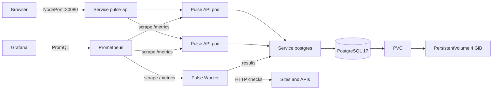

Один container image используется в двух ролях: `ROLE=api` и `ROLE=worker`. API масштабируется независимо от фоновых проверок.

## Технологический стек

| Компонент | Версия / назначение |
|---|---|
| Ubuntu Server | 24.04.5 LTS, VMware VM |
| k0s | v1.36.4+k0s.0, single-node Kubernetes |
| containerd | 2.3.4, container runtime |
| Podman | 4.9.3, сборка OCI image |
| Helm | 3.22.0 |
| kube-prometheus-stack | chart 91.4.0 |
| Node.js | 22 Alpine, API и worker |
| PostgreSQL | 17 Alpine, основная БД |

## Скриншоты

### k0s — состояние single-node кластера

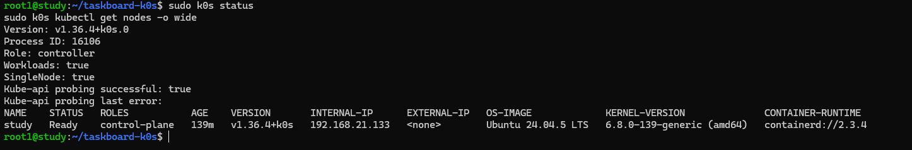

### Kubernetes workload и persistent storage

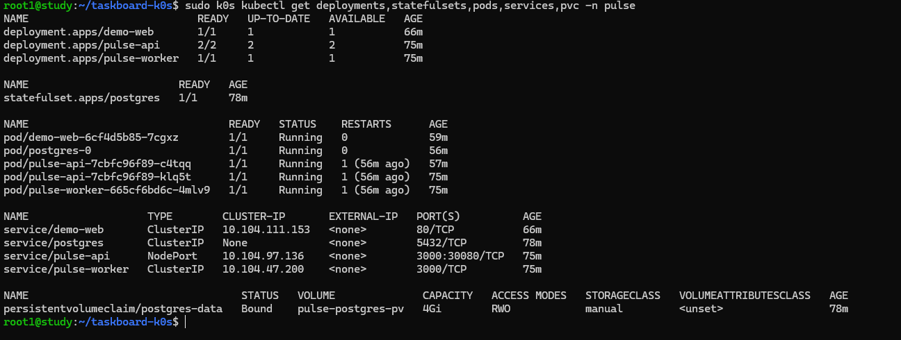

### Pulse — обзор состояния

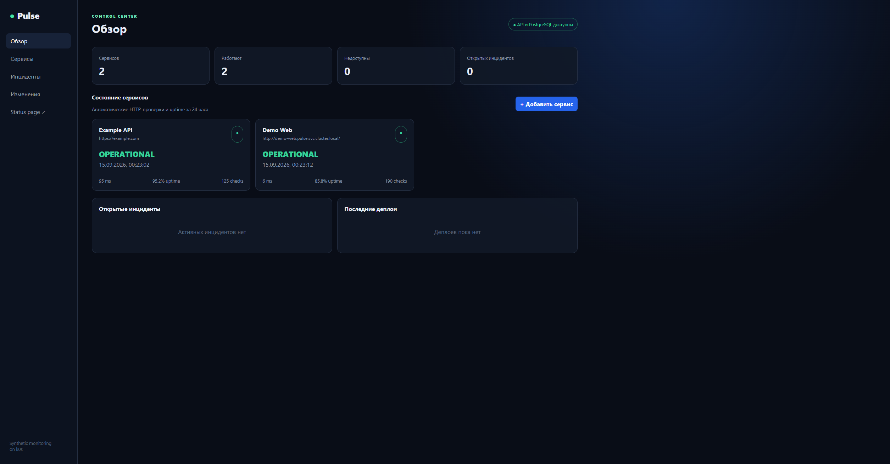

### Управление сервисами

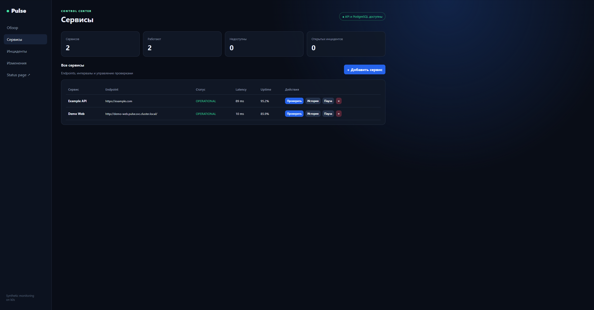

### Инциденты

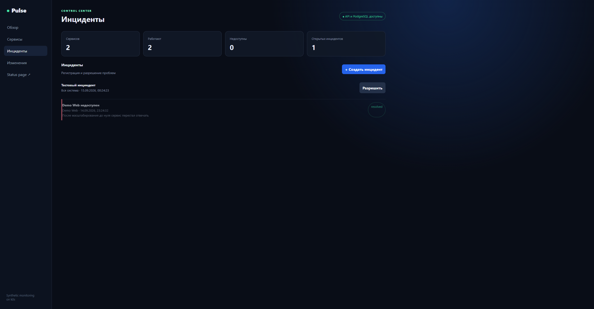

### Деплои и плановые работы

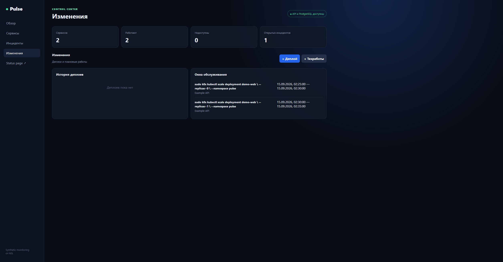

### Grafana — метрики и история отказов

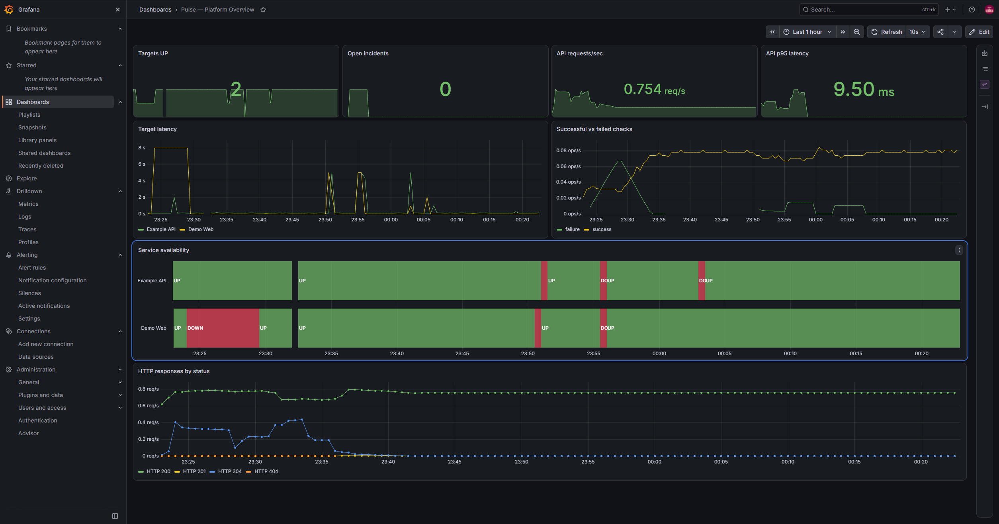

### Prometheus и Grafana в Kubernetes

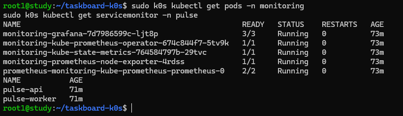

### PostgreSQL — структура базы данных

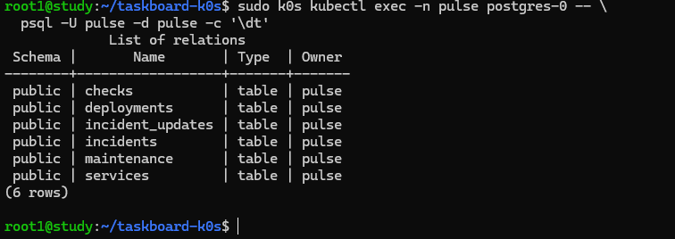

### Обнаруженный отказ сервиса

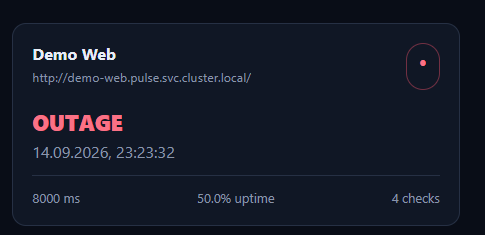

## Структура репозитория

```text
.
├── src/                         # API, worker, схема PostgreSQL и метрики
├── public/                      # Web UI и публичная Status Page
├── k8s/
│   ├── base/                    # Namespace, PostgreSQL, API и worker
│   ├── demo/                    # Тестовый Nginx для outage-сценария
│   └── monitoring/              # Helm values, ServiceMonitor и dashboard
├── scripts/                     # Автоматизированный вариант установки
├── docs/
│   ├── images/                  # Скриншоты результата
│   └── REPORT.md                # Подробный отчёт о выполнении
├── Dockerfile
└── package.json
```

## Быстрый запуск

Требования: Ubuntu Server, минимум 2 vCPU, 6 ГБ RAM и 25 ГБ диска.

```bash
chmod +x scripts/*.sh
./scripts/install-k0s.sh
./scripts/deploy.sh
```

После развёртывания:

- Pulse: `http://<VM_IP>:30080`;
- Status Page: `http://<VM_IP>:30080/status.html`;
- Grafana: выполнить `./scripts/grafana-access.sh`, открыть `http://<VM_IP>:30300`;
- demo credentials Grafana: `admin / admin`.

Подробная ручная установка с пояснением команд находится в [docs/REPORT.md](docs/REPORT.md).

## Проверка отказоустойчивости

Тестовый сервис разворачивается командой:

```bash
sudo k0s kubectl apply -f k8s/demo/demo-web.yaml
```

Добавить в Pulse URL:

```text
http://demo-web.pulse.svc.cluster.local
```

Имитировать отказ:

```bash
sudo k0s kubectl scale deployment demo-web --replicas=0 -n pulse
```

Pulse обнаружит `OUTAGE`, Prometheus сохранит метрику, а Grafana покажет изменение доступности. Восстановление:

```bash
sudo k0s kubectl scale deployment demo-web --replicas=1 -n pulse
```

Дополнительно проверены:

- автоматическое восстановление удалённого API pod;
- восстановление PostgreSQL StatefulSet;
- сохранность данных на PersistentVolume после пересоздания PostgreSQL pod.

## Ограничения учебного стенда

- single-node кластер не обеспечивает отказоустойчивость самой VM;
- `hostPath` подходит только для локального стенда;
- PostgreSQL работает в одной реплике;
- demo secrets хранятся в YAML открытым текстом;
- отсутствуют Ingress, TLS и авторизация;
- перед публичным размещением требуется SSRF-защита URL-проверок.

В production потребовались бы CSI StorageClass, внешний secret manager, managed PostgreSQL или оператор, Ingress с TLS, RBAC, NetworkPolicy, Alertmanager и CI/CD с container registry.
