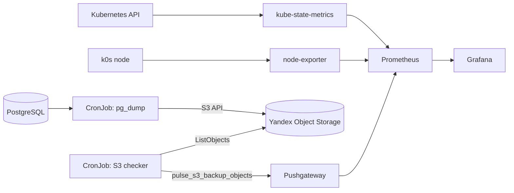

# Мониторинг k0s и внешние бэкапы PostgreSQL

Этот документ описывает отдельное расширение первоначального стенда Pulse:

1. Grafana должна показывать состояние одновузлового k0s-кластера.
2. PostgreSQL должна регулярно копироваться во внешнее хранилище.
3. Хранилище бэкапов не должно участвовать в runtime приложения.
4. Grafana должна показывать фактическое количество backup-файлов в бакете.

## Архитектура



Yandex Object Storage не монтируется в pod приложения и не используется API или worker. Если S3 временно недоступен, Pulse продолжает работать; не выполнится только отдельный backup Job.

## Что показывает cluster-dashboard

Импортируемый dashboard: [k8s/monitoring/cluster-dashboard.json](../k8s/monitoring/cluster-dashboard.json).

Панели:

- готовность Kubernetes-ноды;
- Ready и Not Ready pod;
- недоступные реплики Deployment;
- состояние PostgreSQL StatefulSet и PVC;
- загрузка CPU, RAM и корневой файловой системы ноды;
- число рестартов контейнеров;
- состояние расписания резервного копирования;
- неуспешные backup Job;
- фактическое количество backup-файлов в Yandex Object Storage;
- pod по фазам и реплики Pulse.

Состояние Kubernetes предоставляет `kube-state-metrics`, ресурсы VM — `node-exporter`, а Prometheus хранит временные ряды и выполняет PromQL-запросы Grafana.

## 1. Сборка backup image

Образ содержит PostgreSQL client, AWS CLI для S3-совместимого API Yandex и curl для отправки метрик:

```bash
podman build \
  --file Dockerfile.backup \
  --tag localhost/pulse-backup:1.1.0 \
  .

podman save \
  --output /tmp/pulse-backup-1.1.0.tar \
  localhost/pulse-backup:1.1.0

sudo k0s ctr images import /tmp/pulse-backup-1.1.0.tar
rm /tmp/pulse-backup-1.1.0.tar
```

Podman и containerd k0s используют разные локальные image stores, поэтому образ импортируется вручную.

## 2. Доступ к Yandex Object Storage

Для service account достаточно роли `storage.uploader`: она разрешает загрузку, чтение и просмотр списка объектов. Статические ключи нельзя добавлять в Git.

Создать Kubernetes Secret интерактивно:

```bash
read -rp "AWS access key ID: " PULSE_AWS_ACCESS_KEY_ID
read -rsp "AWS secret access key: " PULSE_AWS_SECRET_ACCESS_KEY
echo

sudo k0s kubectl create secret generic pulse-backup-s3 \
  --namespace pulse \
  --from-literal=AWS_ACCESS_KEY_ID="$PULSE_AWS_ACCESS_KEY_ID" \
  --from-literal=AWS_SECRET_ACCESS_KEY="$PULSE_AWS_SECRET_ACCESS_KEY" \
  --from-literal=AWS_DEFAULT_REGION="ru-central1" \
  --from-literal=S3_ENDPOINT="https://storage.yandexcloud.net" \
  --from-literal=S3_BUCKET="<BUCKET_NAME>"

unset PULSE_AWS_ACCESS_KEY_ID PULSE_AWS_SECRET_ACCESS_KEY
```

Проверка без раскрытия значений:

```bash
sudo k0s kubectl describe secret pulse-backup-s3 -n pulse
```

В Yandex Object Storage настроено lifecycle-правило для префикса `postgres/`: удалять объекты старше 14 дней.

## 3. Регулярный backup

`backup/backup.sh`:

- создаёт custom-format dump через `pg_dump`;
- загружает файл `postgres/pulse-<UTC_TIMESTAMP>.dump`;
- проверяет объект командой `head-object`;
- удаляет временный локальный файл;
- возвращает ошибку, если любой этап не выполнен.

Применить ежедневный CronJob:

```bash
sudo k0s kubectl apply \
  --filename k8s/backup/postgres-backup-cronjob.yaml
```

Расписание: каждый день в 03:00 по `Europe/Moscow`.

Ручной запуск:

```bash
sudo k0s kubectl create job \
  --from=cronjob/pulse-postgres-backup \
  pulse-backup-manual-$(date +%s) \
  --namespace pulse
```

Проверка:

```bash
sudo k0s kubectl get jobs,pods -n pulse
sudo k0s kubectl logs -n pulse job/<JOB_NAME>
```

Job получает статус `Complete` только после загрузки и проверки объекта в S3.

## 4. Фактическое количество файлов в S3

Pushgateway устанавливается отдельно от kube-prometheus-stack:

```bash
helm upgrade --install pushgateway \
  prometheus-community/prometheus-pushgateway \
  --namespace monitoring \
  --values k8s/monitoring/pushgateway-values.yaml \
  --wait
```

Затем применяется S3-checker:

```bash
sudo k0s kubectl apply \
  --filename k8s/backup/s3-backup-metrics.yaml
```

Каждые пять минут checker выполняет `ListObjects` для префикса `postgres/` и отправляет gauge:

```text
pulse_s3_backup_objects
```

Цепочка данных:

```text
Yandex Object Storage
  -> S3 checker CronJob
  -> Pushgateway
  -> Prometheus
  -> Grafana
```

Ручная проверка checker:

```bash
sudo k0s kubectl create job \
  --from=cronjob/pulse-s3-backup-metrics \
  pulse-s3-metrics-manual-$(date +%s) \
  --namespace pulse
```

В логах должны появиться строки:

```text
Backups found in S3: <COUNT>
Metric sent successfully
```

В Prometheus или Grafana Explore:

```promql
pulse_s3_backup_objects
```

Метрика обновляется раз в пять минут и отражает число объектов в бакете, а не число сохранённых Kubernetes Job.

## 5. Импорт dashboard

В Grafana открыть `Dashboards -> New -> Import`, загрузить:

```text
k8s/monitoring/cluster-dashboard.json
```

При импорте выбрать существующий datasource Prometheus. Dashboard не содержит паролей, access key или endpoint с приватными параметрами.

## Проверка результата

```bash
sudo k0s kubectl get nodes
sudo k0s kubectl get deployments,statefulsets,pods,services,pvc -n pulse
sudo k0s kubectl get cronjobs,jobs -n pulse
sudo k0s kubectl get pods,service,servicemonitor -n monitoring
```

Ожидаемый итог:

- k0s-нода находится в `Ready`;
- PostgreSQL и Pulse работают;
- PVC находится в `Bound`;
- backup CronJob включён;
- ручной backup завершается успешно;
- dump появляется в Yandex Object Storage;
- `pulse_s3_backup_objects` совпадает с количеством файлов в `postgres/`;
- Grafana отображает состояние кластера и внешних бэкапов.

## Ограничения стенда

- single-node k0s не переживёт отказ всей VM;
- Pushgateway хранит последнее переданное значение, поэтому счётчик может отставать максимум на пять минут;
- ключи S3 хранятся в Kubernetes Secret, а не во внешнем secret manager;
- восстановление БД следует проверять отдельным restore-тестом;
- локальные OCI-образы нужно повторно импортировать после пересборки.
