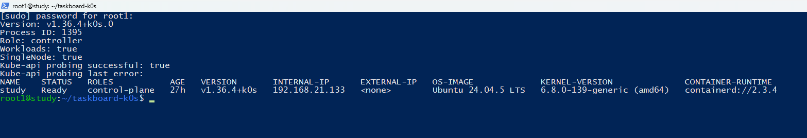
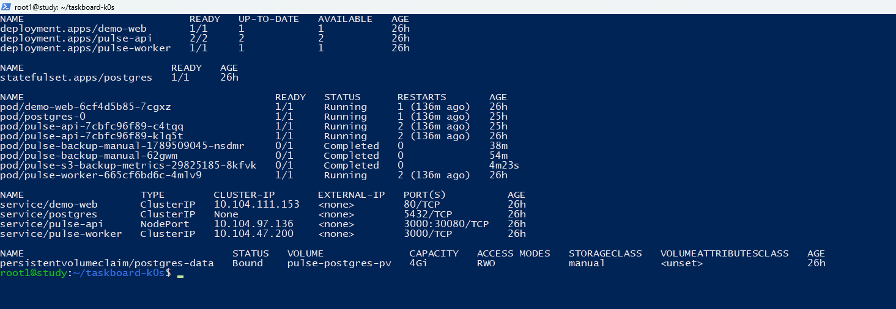
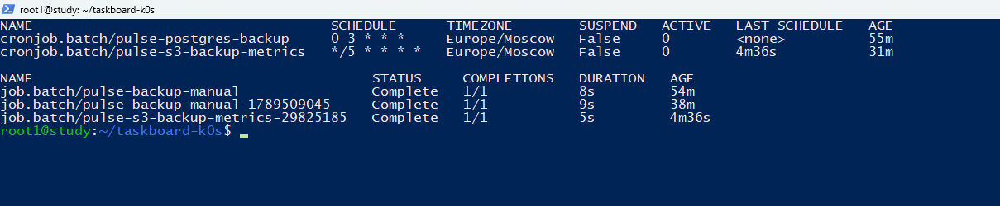
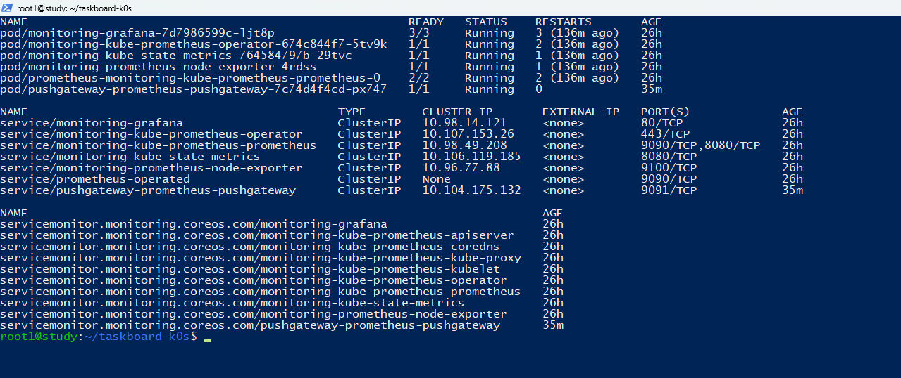
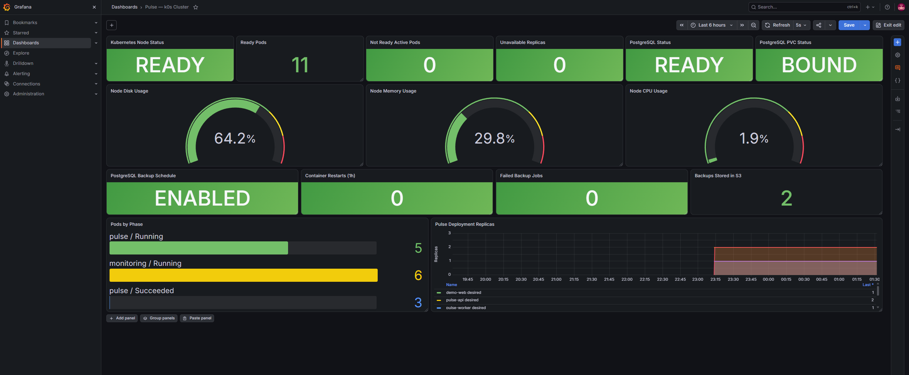
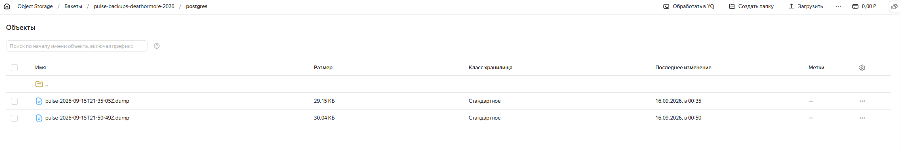
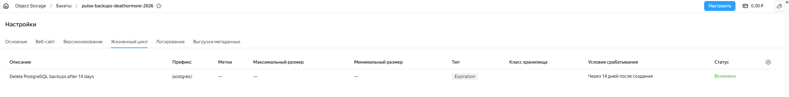

# Подтверждение мониторинга k0s и внешних бэкапов

## Аннотация

Расширение стенда решает две эксплуатационные задачи. Первая — наблюдение не только за приложением Pulse, но и за Kubernetes-окружением: состоянием ноды, pod, Deployment, PostgreSQL, PVC и ресурсами VM. Вторая — регулярное резервное копирование PostgreSQL во внешнее S3-совместимое хранилище, которое не участвует в runtime приложения.

Итоговая цепочка мониторинга:

```text
Kubernetes API -> kube-state-metrics ┐
k0s node       -> node-exporter      ├-> Prometheus -> Grafana
Pulse /metrics -> ServiceMonitor     ┘
```

Итоговая цепочка бэкапа:

```text
PostgreSQL -> backup CronJob -> Yandex Object Storage
                                  |
                                  v
S3 checker CronJob -> Pushgateway -> Prometheus -> Grafana
```

Yandex Object Storage является внешним хранилищем. Оно не монтируется в API, worker или PostgreSQL и не обслуживает пользовательские запросы Pulse. Поэтому временная недоступность S3 не останавливает приложение: завершится ошибкой только отдельная backup-задача.

## 1. Состояние k0s



**Что показано:** работающий controller, включённые workloads, успешная проверка Kubernetes API и нода `study` в состоянии `Ready`.

**Что подтверждает:** базовый «квази-кластер» действительно запущен и способен размещать workload.

## 2. Workload приложения и постоянное хранилище



**Что показано:** Deployment `pulse-api`, `pulse-worker`, тестовый `demo-web`, StatefulSet `postgres`, работающие pod и PVC `postgres-data` в состоянии `Bound`.

**Что подтверждает:** приложение, база данных и persistent storage реально развёрнуты в Kubernetes.

## 3. Регулярность резервного копирования



**Что показано:** ежедневный `pulse-postgres-backup`, пятиминутный `pulse-s3-backup-metrics` и успешно завершённые Job.

**Что подтверждает:** резервное копирование выполняется по расписанию, а не запускается вручную как разовая демонстрация.

## 4. Подтверждение успешного backup

Результат подтверждается сразу на трёх уровнях:

- в разделе 3 backup Job завершены со статусом `Complete`;
- в разделе 10 в Yandex Object Storage видны два dump-файла с разными временными метками;
- в разделе 6 Grafana показывает `Backups Stored in S3 = 2`.

**Что подтверждает:** backup-задача не просто запускается по расписанию — файлы фактически появляются во внешнем бакете, а их количество независимо проверяется через S3 API и отображается в мониторинге.

## 5. Pushgateway и сбор метрики



**Что показано:** работающий pod и Service Pushgateway, а также обнаруживающий его ServiceMonitor.

**Что подтверждает:** значение количества файлов из короткоживущего CronJob остаётся доступным Prometheus после завершения Job.

## 6. Grafana: состояние кластера и backup-контура



**Что показано:**

- Kubernetes Node Status — `READY`;
- Ready и Not Ready pod;
- недоступные реплики;
- PostgreSQL — `READY`;
- PVC — `BOUND`;
- загрузка диска, RAM и CPU;
- включённое расписание PostgreSQL backup;
- число неуспешных backup Job;
- фактическое количество объектов в S3;
- pod по фазам и желаемые/доступные реплики.

**Что подтверждает:** Grafana «ухватывает стейт куба», состояние VM и отдельный backup-контур.

## 7. Манифест ежедневного backup CronJob

Реализация: [k8s/backup/postgres-backup-cronjob.yaml](../k8s/backup/postgres-backup-cronjob.yaml).

**Что реализовано:** расписание `0 3 * * *`, часовой пояс `Europe/Moscow`, запрет параллельных запусков, backup image и получение реквизитов из Kubernetes Secret.

**Что подтверждает:** расписание и конфигурация описаны декларативно и воспроизводятся из Git.

## 8. Создание, отправка и проверка dump

Реализация: [backup/backup.sh](../backup/backup.sh).

**Что реализовано:** `pg_dump` в custom format, команда `aws s3 cp` и последующий `head-object`.

**Что подтверждает:** backup не считается успешным до появления объекта во внешнем хранилище.

## 9. Подсчёт реальных объектов S3

Реализация: [k8s/backup/s3-backup-metrics.yaml](../k8s/backup/s3-backup-metrics.yaml).

**Что реализовано:** получение списка объектов с префиксом `postgres/`, вычисление их количества и публикация gauge `pulse_s3_backup_objects` в Pushgateway.

**Что подтверждает:** Grafana показывает не число Kubernetes Job, а количество файлов, реально находящихся в бакете.

## 10. Внешнее хранилище



**Что показано:** объекты `pulse-<timestamp>.dump` внутри префикса `postgres/` бакета Yandex Object Storage.

**Что подтверждает:** копии находятся за пределами диска VM и persistent volume кластера.

## 11. Политика хранения



**Что показано:** lifecycle-правило для `postgres/`, удаляющее объекты старше 14 дней.

**Что подтверждает:** хранилище не растёт бесконечно, retention управляется на стороне Object Storage.

## Соответствие исходной задаче

| Требование | Реализация | Подтверждение |
|---|---|---|
| Мониторить «квази-кластер» | kube-state-metrics, node-exporter, Prometheus, Grafana | разделы 1, 2, 5 и 6 |
| Как минимум получить state Kubernetes | Node, pod phases, Deployment replicas, StatefulSet, PVC | разделы 1, 2 и 6 |
| Делать backup регулярно | Kubernetes CronJob каждый день в 03:00 | разделы 3 и 7 |
| Сохранять backup внешне | Yandex Object Storage через S3 API | разделы 4, 8 и 10 |
| Хранилище не участвует в runtime | S3 используется только отдельными CronJob | архитектура и разделы 7–10 |
| Контролировать сохранённые файлы | S3 checker, Pushgateway, метрика `pulse_s3_backup_objects` | разделы 5, 6 и 9 |
| Ограничить срок хранения | Lifecycle expiration через 14 дней | раздел 11 |

## Вывод

Pulse работает независимо от backup-хранилища, PostgreSQL ежедневно копируется во внешний бакет, а Grafana показывает как состояние Kubernetes, так и состояние backup-контура. Решение остаётся учебным single-node стендом, но демонстрирует основные практики эксплуатации: declarative configuration, observability, scheduled jobs, external backups, retention и проверку результата.
